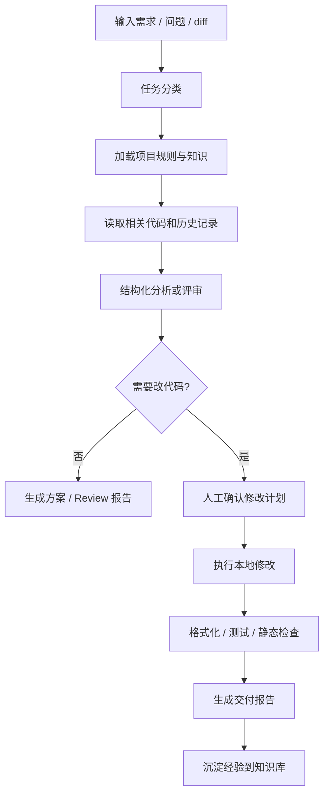
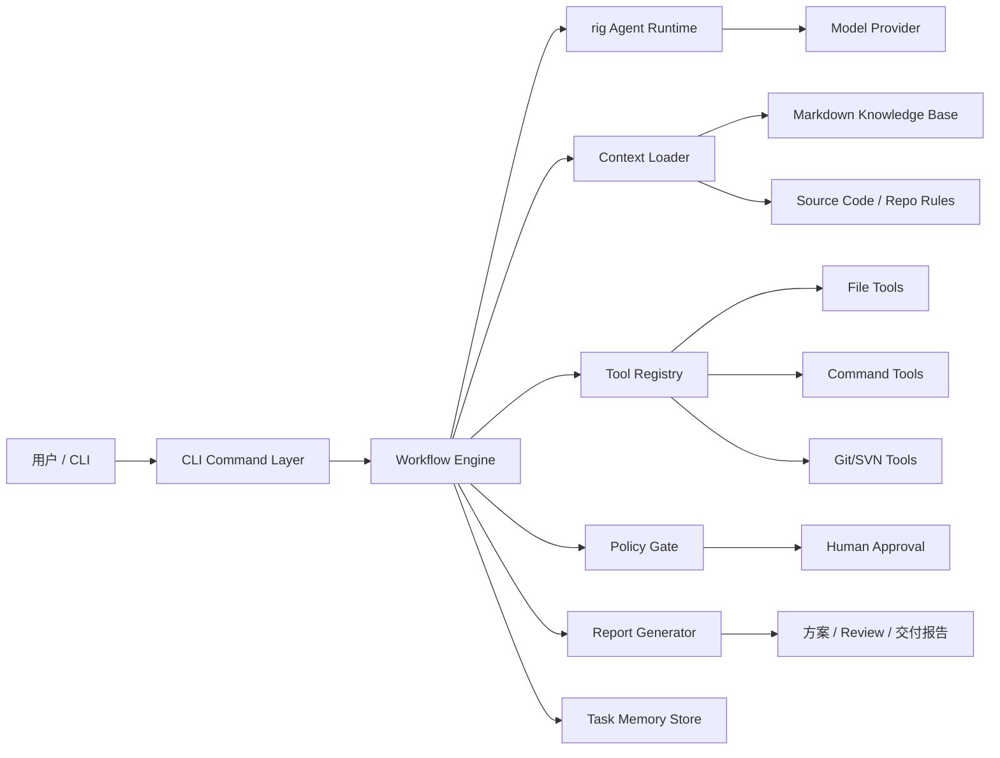

# AI数字人计划 V1 设计文档

日期：2026-07-01

## 1. 背景

团队负责人在 AI 时代的核心职责，不只是让 AI 写代码，而是把团队研发方法、工程判断、评审经验和交付标准转化为可复用的生产力系统。

现有 Codex 等通用编码 Agent 已经能完成大量代码阅读、修改、测试和解释工作。因此 AI数字人计划 V1 不重复构建一个通用 Codex，而是基于 Rust rig 构建一个面向公司服务端研发流程的 CLI 型研发数字人。它把通用大模型能力封装进公司研发工作流，持续沉淀私有工程知识，并在受控权限下辅助小范围代码执行。

## 2. 产品定位

AI数字人计划 V1 是一个基于 Rust rig 的 CLI 型服务端研发协作 Agent，面向 Go/Rust 服务端团队负责人和少数核心研发。它的定位是“技术负责人助手 + 轻量执行者”。

V1 的核心差异化不在于模型本身，而在于：

- 封装公司研发工作流。
- 沉淀私有工程知识和团队规范。
- 用固定流程约束 Agent 行为，避免自由 Agent 失控。
- 将方案、评审、验证和复盘转化为可追踪记录。

## 3. 目标用户

第一阶段服务：

- 团队负责人。
- 少数核心 Go/Rust 服务端研发。

后续阶段再扩展到：

- 更多研发成员。
- Web 工作台用户。
- IM 群聊或机器人用户。

## 4. 核心目标

V1 需要达成以下目标：

- 减少重复需求澄清、路径查找、方案拆解和评审工作。
- 固化技术负责人的工程判断和交付习惯。
- 对真实 Go/Rust 服务端项目输出结构化方案、影响面分析和 Code Review。
- 在人工确认后完成小范围本地代码修改、格式化和验证。
- 将每次任务的输入、决策、风险、验证结果和经验沉淀为可读文档与结构化记忆。

## 5. 非目标

V1 明确不做以下内容：

- 不做通用编码工具替代品。
- 不构建 Web 工作台。
- 不接入 IM 机器人。
- 不实现完整 RAG 或向量数据库检索。
- 不实现多人权限平台。
- 不自动提交、推送、发布或修改生产配置。
- 不承诺自动完成复杂新功能或大规模重构。
- 不允许模型绕过工具和权限系统直接执行副作用动作。

## 6. 产品范围

### 6.1 范围内

- CLI 入口。
- 项目初始化。
- 工程知识问答。
- 需求澄清与技术方案。
- 影响面分析。
- Code Review。
- 受控小步代码修复。
- Markdown 知识库。
- JSONL 结构化任务记忆。
- Markdown 报告生成。
- 单模型调用，架构预留多模型 provider 和路由。

### 6.2 范围外

- Web 前端。
- IM 集成。
- 企业级账号和权限系统。
- 自动部署。
- 数据库变更执行。
- 线上配置变更。
- 代码自动提交和推送。
- 大规模向量检索。

## 7. 用户场景

### 7.1 需求澄清与技术方案

用户输入一段需求描述，数字人读取项目规则、知识库和相关代码，输出目标、非目标、影响面、涉及模块、风险、验收标准和验证计划。

### 7.2 影响面分析

用户输入模块名、文件路径、函数名、协议名或需求描述，数字人输出可能涉及的代码路径、调用链、协议风险、状态风险、持久化风险和测试入口。

### 7.3 Code Review

用户指定本地 diff 或文件路径，数字人按业务正确性、协议兼容性、状态一致性、测试缺口和可维护性进行结构化评审。

### 7.4 小步修复

用户描述一个低风险问题，数字人先输出修复计划和影响面。用户确认后，数字人修改本地文件，运行格式化和目标测试，并生成交付报告。

### 7.5 经验沉淀

任务完成后，数字人将关键决策、规则变化、踩坑经验和可复用案例写入 Markdown 知识库与结构化任务记忆。

## 8. CLI 命令设计

V1 推荐命令：

```bash
ai-human init
ai-human ask
ai-human plan
ai-human impact
ai-human review
ai-human fix
ai-human learn
```

### 8.1 ai-human init

初始化项目数字人配置，识别 Go/Rust 项目结构，创建知识库目录、任务记录目录、默认工作流模板和权限策略。

### 8.2 ai-human ask

基于项目规则、README、`.agents`、知识库和历史任务记录回答工程问题。

### 8.3 ai-human plan

输入需求描述，输出需求澄清、目标、非目标、影响面、风险、验收标准和验证计划。

### 8.4 ai-human impact

输入需求、文件路径、函数名、协议名或模块名，输出调用链、依赖系统、可能改动文件、协议风险、状态风险和持久化风险。

### 8.5 ai-human review

读取本地 diff 或指定文件，对业务正确性、协议兼容、状态一致性、测试缺口和可维护性做分级评审。

### 8.6 ai-human fix

受控小步修复命令。修改前必须生成计划并获得人工确认。修改后运行格式化、目标测试或替代验证，并生成交付报告。

### 8.7 ai-human learn

把任务结论、踩坑、规则变更和可复用模板写入 Markdown 知识库和结构化任务记忆。

## 9. 标准工作流



每个命令都应尽量遵循固定阶段：

- 任务分类。
- 加载规则。
- 读取上下文。
- 输出结构化计划或评审。
- 标注风险与缺口。
- 执行前确认。
- 执行后验证。
- 生成报告。
- 沉淀经验。

## 10. 技术架构



### 10.1 CLI Command Layer

负责命令入口、参数解析、交互确认和终端输出。CLI 不直接读写业务文件，不直接调用模型，不直接执行命令。

### 10.2 Workflow Engine

负责研发工作流编排。它定义 `plan`、`impact`、`review`、`fix`、`learn` 的阶段和输入输出。Workflow 依赖 trait 接口，不依赖具体文件系统、模型 SDK 或数据库实现。

### 10.3 rig Agent Runtime

封装 Rust rig 的 Agent 调用，负责模型 provider、prompt 模板、工具调用描述、结构化输出解析和模型错误处理。

### 10.4 Context Loader

加载项目规则、README、`.agents`、Markdown 知识库、目标代码和历史任务记录。Context Loader 负责明确上下文来源，避免 prompt 自行猜测应该读取什么。

### 10.5 Tool Registry

注册文件、搜索、命令、Git/SVN、格式化、测试等工具。所有工具都有权限等级、输入约束和执行记录。

### 10.6 Policy Gate

统一判断动作是否允许执行，是否需要人工确认，是否属于高风险动作。权限判断必须集中在 Policy Gate，不散落在各命令中。

### 10.7 Task Memory Store

保存任务、决策、评审问题和沉淀经验。V1 使用 JSONL 文件，后续任务量变大后可迁移到 SQLite。

### 10.8 Report Generator

将结构化结果渲染为 Markdown 报告。Report Generator 不直接解析模型原文，只接收经过 schema 校验的结构化数据。

## 11. 架构原则与模块边界

### 11.1 SOLID 原则

单一职责：

- CLI 只负责交互入口。
- Workflow 只负责编排阶段。
- Agent Runtime 只负责模型调用。
- Context Loader 只负责上下文加载。
- Tool Registry 只负责工具发现和执行代理。
- Policy Gate 只负责权限判断。
- Memory Store 只负责记忆读写。
- Report Generator 只负责报告渲染。

开闭原则：

- 新增工作流通过实现新的 workflow handler 扩展。
- 新增工具通过 tool trait 和 registry 扩展。
- 新增模型通过 model provider trait 扩展。
- 新增记忆后端通过 memory store trait 扩展。

接口隔离：

- 不设计巨大 `AgentTool` 接口。
- 拆分为 `FileTool`、`SearchTool`、`CommandTool`、`VcsTool`、`FormatterTool`、`TestTool`、`MemoryStore`、`ReportWriter` 等小接口。

依赖倒置：

- 核心工作流依赖 trait，不依赖具体 SDK、数据库、命令执行器或文件系统实现。
- 具体实现放在 adapters 层，由组合根注入。

### 11.2 高内聚低耦合

- Workflow 不直接读写文件。
- Policy Gate 不嵌入业务 prompt。
- Context Loader 不负责权限判断。
- Tool Registry 不生成报告。
- Report Generator 不调用模型。
- Memory Store 不理解业务流程，只保存结构化记录。

### 11.3 分层建议

```text
cli/              命令入口与参数解析
core/             任务、报告、风险、权限等领域模型
workflow/         plan / impact / review / fix / learn 工作流
agent/            rig 封装、模型调用、结构化输出
context/          项目规则、知识库、代码上下文加载
tools/            文件、搜索、命令、Git/SVN、测试工具接口
policy/           权限判断、人工确认、高风险动作拦截
memory/           JSONL/SQLite 任务记忆
report/           Markdown 报告生成
adapters/         具体模型、文件系统、命令执行、VCS 实现
```

### 11.4 架构红线

V1 禁止让模型直接决定文件系统、命令执行、提交发布等副作用动作。所有副作用必须经过 Tool Registry 和 Policy Gate。

V1 禁止将 prompt、文件系统操作、权限判断、报告生成和任务记忆写入同一个大模块。

V1 禁止用不可测试的自由 Agent 循环替代明确工作流。

## 12. 知识库与任务记忆

### 12.1 目录结构

```text
.ai-human/
  config.toml
  policy.toml
  knowledge/
    README.md
    project-map.md
    engineering-rules.md
    workflows/
      requirement-plan.md
      impact-analysis.md
      code-review.md
      small-fix.md
    cases/
      2026-07-01-example.md
    faq.md
  memory/
    tasks.jsonl
    decisions.jsonl
    reviews.jsonl
    learnings.jsonl
  reports/
    2026-07/
      task-xxxx-plan.md
      task-xxxx-review.md
      task-xxxx-delivery.md
  templates/
    plan-output.md
    review-output.md
    delivery-output.md
```

### 12.2 Markdown 知识库

`project-map.md` 记录项目结构、跨仓库关系、服务边界和常用路径。

`engineering-rules.md` 记录协议兼容、状态一致性、测试要求、禁止事项和提交前检查。

`workflows/` 记录需求分析、影响面分析、Code Review、小步修复等固定流程。

`cases/` 记录典型需求、典型 bug、典型评审和典型交付案例。

`faq.md` 记录常见问题和路径索引。

### 12.3 结构化记忆

`tasks.jsonl` 记录任务主线：

```json
{
  "task_id": "20260701-001",
  "type": "impact_analysis",
  "repo": "server",
  "input": "分析某需求影响面",
  "status": "completed",
  "started_at": "2026-07-01T21:00:00+08:00",
  "completed_at": "2026-07-01T21:08:00+08:00",
  "summary": "涉及协议映射、service activity、dao cache",
  "report_path": ".ai-human/reports/2026-07/task-20260701-001-plan.md"
}
```

`decisions.jsonl` 记录关键决策：

```json
{
  "task_id": "20260701-001",
  "decision": "不修改客户端 slot 协议，优先扩展内部 rpc",
  "reason": "避免破坏客户端兼容性",
  "risk": "需要确认计算服字段映射"
}
```

`reviews.jsonl` 记录评审问题：

```json
{
  "task_id": "20260701-002",
  "severity": "P1",
  "file": "service/activity/example.go",
  "line": 128,
  "issue": "状态更新后未持久化，重连可能丢状态",
  "suggestion": "在状态变更后补充持久化或明确无需恢复"
}
```

`learnings.jsonl` 记录可复用经验：

```json
{
  "source_task_id": "20260701-003",
  "category": "protocol",
  "learning": "新增玩法优先扩展 rpc 协议，不默认修改客户端 slot 协议",
  "target_doc": ".ai-human/knowledge/engineering-rules.md"
}
```

## 13. 权限模型

### 13.1 权限等级

`L0 Read`：读取文件、搜索代码、读取 README、`.agents`、历史任务记录。默认允许。

`L1 Analyze`：调用模型分析需求、生成方案、评审 diff、总结报告。默认允许。

`L2 Local Write`：修改本地文件、生成报告、写入 `.ai-human/` 记忆。需要任务计划和人工确认。

`L3 Verify`：运行格式化、单测、静态检查、目标包验证。允许执行，但必须记录命令、输出摘要和失败原因。

`L4 VCS Mutate`：提交、打 tag、推送、创建分支、合并、回滚。V1 默认禁止或必须二次确认。

`L5 External Side Effect`：发布、部署、线上配置、数据库变更、通知外部系统。V1 范围外。

### 13.2 高风险动作

以下动作必须拦截：

- 删除文件或目录。
- 批量替换。
- 修改协议字段编号。
- 修改公共框架。
- 修改生产配置。
- 操作数据库。
- 提交、推送、发布。
- 跳过测试并声称完成。
- 在没有影响面分析的情况下改代码。

## 14. 模型策略

V1 采用单模型优先策略，降低 MVP 复杂度。

架构上预留：

- model provider 配置。
- 默认模型配置。
- 按任务类型选择模型的扩展点。
- 本地或内网模型接入空间。
- 多模型路由空间。

模型输出必须尽量经过结构化 schema 约束，再进入 Workflow、Report 和 Memory。

## 15. 质量评估

V1 使用工程指标评估，不使用“智能程度”这类模糊指标。

- 方案完整度：是否包含目标、非目标、影响面、风险和验证计划。
- Review 命中率：评审问题中有多少被负责人认可为有效。
- 误报率：低价值或错误评审占比。
- 任务节省时间：一次需求分析或评审节省多少负责人时间。
- 验证覆盖率：修改任务中有多少附带真实验证证据。
- 知识沉淀率：多少任务产出了可复用规则、案例或 FAQ。
- 人工干预点：哪些环节经常需要人补充，反推下一轮优化。

## 16. 失败处理

数字人必须允许输出不确定性，不能假装完成。

常见失败状态：

- 上下文不足。
- 缺少目标仓库。
- 无法确认协议来源。
- 未找到测试入口。
- 命令执行失败。
- 需要人工确认业务语义。
- 只能给出分析，不能安全修改。

失败输出必须包含：

- 已完成的检查。
- 阻塞原因。
- 最小可继续路径。
- 建议人工确认的问题。

## 17. 测试策略

### 17.1 单元测试

- Workflow 可使用 mock tools 测试阶段编排。
- Policy Gate 独立测试权限判断和高风险动作拦截。
- Context Loader 测试规则和知识库加载顺序。
- Memory Store 测试 JSONL 读写和异常恢复。
- Report Generator 使用 snapshot 测试 Markdown 输出。

### 17.2 集成测试

- 使用临时项目目录验证 `init`。
- 使用示例知识库验证 `ask`、`plan`、`impact`。
- 使用示例 diff 验证 `review`。
- 使用低风险示例文件验证 `fix` 的计划、确认、修改、验证和报告流程。

### 17.3 人工验收

- 在真实 Go 服务端仓库中完成 3 类需求的技术方案输出。
- 对真实 diff 产出有价值的 Code Review。
- 完成 1 到 2 个低风险小修复，并附带验证报告。
- 每次任务生成报告和结构化记忆。

## 18. 里程碑

### M0 产品骨架

- Rust CLI 工程初始化。
- 配置文件、权限策略、知识库目录、任务记忆目录。
- `init` 命令可用。

### M1 分析闭环

- `ask`、`plan`、`impact` 可用。
- 能加载本地项目规则和 Markdown 知识库。
- 输出结构化方案报告。

### M2 评审闭环

- `review` 可读取 diff 或指定文件。
- 按业务正确性、协议兼容、状态一致性、测试缺口输出评审。
- 评审结果写入报告和 `reviews.jsonl`。

### M3 受控执行闭环

- `fix` 支持小范围修改。
- 修改前输出计划并要求确认。
- 修改后运行格式化、目标测试或替代验证，并生成交付报告。

### M4 知识复利

- `learn` 可把任务结论写入知识库和结构化记忆。
- 支持从历史任务中总结 FAQ、规则和案例。
- 为后续 RAG、Web 和 IM 打基础。

## 19. MVP 验收建议

V1 到 M2 即可开始给核心研发试用。M3 作为受控实验能力，不在早期承诺全自动开发。

MVP 验收标准：

- `init` 可初始化项目知识库和策略。
- `plan` 可生成结构化技术方案。
- `impact` 可生成影响面分析。
- `review` 可对真实 diff 输出有价值评审。
- 任务报告可落盘。
- 任务记忆可追加 JSONL。
- 权限策略能拦截高风险动作。
- 代码结构遵循分层边界，核心工作流可测试。

## 20. 后续演进

V1 稳定后再考虑：

- SQLite 任务记忆。
- RAG 和向量数据库。
- Web 工作台。
- IM 机器人。
- 多模型路由。
- 团队权限系统。
- CI 集成。
- Git/SVN 自动生成评审报告。

后续演进必须以 V1 的工作流质量、评审有效性和知识沉淀质量为依据，不应为了平台化而提前增加复杂度。
